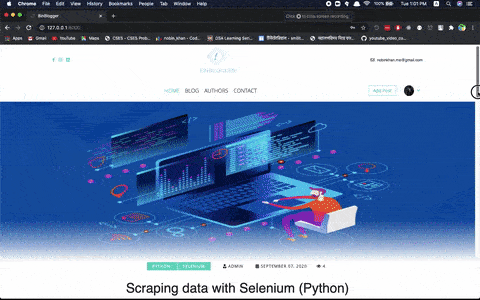

# BinBlogger

◎◎ A comprehensive multi-user blog app



## Descriptions

This is a **full featured Django Blog** App that is customizable and extendable. This App contains almost every fucntionality a multi-user blog needs.

 For better view of the project visit the [Demo](http://binblogger.pythonanywhere.com/) Site.

## Blog Features

- Multi User Authentication
- Post CRUD
- Comments and Reply Functionalities
- Search Fuctionalies
- Tag, Categories and top Categories(based on posts count) Functionalities.
- Profile create & Profile Update on registration
- Visual Post editor(medium-editor plugin)
- Featured Post, Popular Posts and Recent posts
- Post views count.
- Redirect alert massages.
- Preview image before upload.
- Auto image optimization on upload.
- Authors page with posts and commnets count.
- Page for posts of individual tag, category and user.
- User Authentication to view pages
- Delete post-thumbnail when post deleted
- Admin Panel &User dashboard with Jquery live search
- Newsleters & Contact Page
- Category multi-select functionalities (Jquery multiselect plugin)
- Python Code syntax highlighter on Details view(Jquery prism plugin)

> [❗] Look through the setup process before using this project so that you can avoid errors.

## Setup Process

> ❗Make sure You have python3 and pip installed on your machine.

### Step 1

1. Create a folder where you want to clone the project.
   - I am creating a folder named ‘example’ in desktop

2. Now navigate to "example" via cmd or terminal

(Mac)

```bash
cd ~/desktop/example
```

(Windows)

 ```shell
cd C:\Users\YourDesktopName\Desktop\example
 ```

### Step 2

> ℹ️ *Optional but better to use a virtual environment for every project.*

If don’t have any virtual environment manager installed in your machine then install one. (I will use pipenv)

For installing pipenv run

```bash
pip install pipenv
```

1. Now clone the project and navigate to BinBlogger-master

```bash
git clone git@github.com:m-nobinur/BinBlogger.git
cd BinBlogger-master
```

2. Install all the dependencies for the project.


```bash
pipenv install -r requirements.txt
```

3. Activate the virtual environment

```bash
pipenv shell
```

### Step 3

1. Create a .env file in the project directory, open it with your favorite text editor and paste the bellow lines

```.file
SECRET_KEY=[YOUR SECRET_KEY]
DEBUG=True
MAILCHIMP_API_KEY=[YOUR MAILCHIMP_API_KEY]
MAILCHIMP_DATA_CENTER=[YOUR MAILCHIMP_DATA_CENTER]
MAILCHIMP_EMAIL_LIST_ID=[YOUR MAILCHIMP_DATA_CENTER]
```

2. Now generate a secret key for your project.

run python on your shell

```bash
python
```

``` python
>>>from django.core.management.utils import get_random_secret_key
>>>get_random_secret_key()
>>>[ YOUR SECRET KEY ]
```

3. Copy the secret key, open .env file again and assign the secret key. If you don't have mailchimp credentials then make sure your file look like this

```.file
SECRET_KEY=YOUR_SECRET_KEY
DEBUG=True
MAILCHIMP_API_KEY=''
MAILCHIMP_DATA_CENTER=''
MAILCHIMP_EMAIL_LIST_ID=''
```

> ⚠️ make sure not to use any space between the equal(=) sign or any quotations(“) for the secret key

> ℹ️
> If you want to setup Mailchimp now then go to this [section](mailchimp_setup.md)

4. Make a migrations.

```bash
python manage.py makemigrations
```

5. You are all setup, let’s migrate now.

```bash
python manage.py migrate
```

6. Create a superuser to rule the site 😎

```bash
python manage.py create superuser

```

> *follow the instructions*

6. Hahh! Long wait. Let’s visit the site now

```bash
python manage.py runserver
```

Visit [http://127.0.0.1:8000/](http://127.0.0.1:8000/) and rock 🤘

---

## Contribution and Support

Fork the project to contribute and give a star❤️
to support.

## Contact

Find me on LinkedIn [@mohammadnobinur](https://www.linkedin.com/in/mohammadnobinur/)
